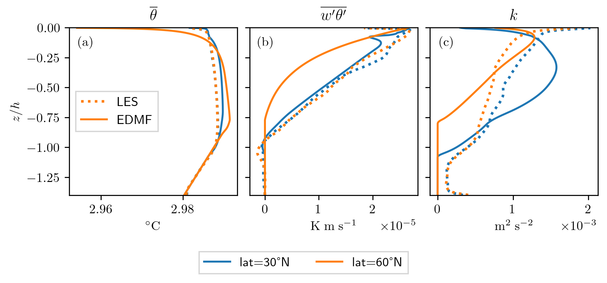

### Comprend pas pq même avec le bon flux ça marche pas...
    'Cent': 0.6,
    'Cdet': 1.99,       # 'Cdet': 2.5,
    'wp_a': 1.5,
    'wp_b': 1.5,      # 'wp_b': 1.
    'wp_bp': 0.003*250,     #      0.002,
    'up_c': 0.5,
    'vp_c': 0.5,
    'bc_ap': 0.2,    #0.3,
    'delta_bkg': 0.02*250,   # 0.02,
    'output_filename': 'run',
    'wp0':-1.e-08,
    'write_netcdf': True
    + pas de modif de ent/det

### je pense qu'il doit y avoir échange entre u et v (et wu, wv) dans MNH...
- Ca expliquerait aussi pq les panaches partaient pas dans le bon sens...
- MAIS d'après calcul d'ondes inertielles (cf MAthsFluids): $\underline{U}_m(t)=\frac{u_*^2}{h(t)if} (1-e^{-ift})$ + plot sur wolfram c'est les bons signes pour W05_C500_CORIO...
- [X] vérifier direction sur NTrad drift LES vs litté : cohérent avec Stranéo (=pas d'erreur ds MNH)  
- [ ] demander à Florian de faire tourner WANG1 pour vérifier...
- [W] vérifier signe de la CL cohérente de TKE quand wp0 est fort... --> fait dans scm.class, ne change rien...
- [ ] inverser up et vp quand on appelle le flux de masse. 

    'Cent': 0.3,    
    'Cdet': 1.99,       # 'Cdet': 2.5,
    'wp_a': 1.,
    'wp_b': 1.,      # 'wp_b': 1.
    'wp_bp': 0.003*250,     #      0.002,
    'up_c': 0.5,
    'vp_c': 0.5,
    'bc_ap': 0.35,    #0.3,
    'delta_bkg': 0.02*250,   # 0.02,
    'output_filename': 'run',
    'wp0':-1.e-02,

### Pb de CL de U ? 

cf wu coincident proche surface pour les et scm, mais dz_u ne part pas dans le même sens:
- [ ] changer à la main dans le fortran pour voir
    - dans advance_dyn_mf -uFlx ne fait rien
    - dans advance_dyn_mf changer + FC en - FC fait des instabilités pas bonnes
    - 
- [ ] demander à Florian simu CROCO, pour voir si c'est pas un pb de CL de MNH...

### explication delta0 plus fort
doit ere du au fait que le terme c'est $\delta_0 / h$. Mais avec rot, il faut remplacer $h$ par le rayon $r$ qui doit tendre vers $l_{\rm rot}$ quand $Ro \ll 1$ ? Utiliser une interpolation en tanh entre lrot et h? Besoin d'être justifiée par plusieurs LES... Ou même LES a des instanst différents ? + utiliser longueur intégrale de WANG.

Avec une modulation cff = tanh(Ro^0.37) comme dans Wang de Cent, Cdet (réduit), et de lrot = h x cff pour detla0 et wp_bp, on arrive à retrouver bon résultats sans les coeff (sauf ) !!  

WOUHOU! trad_coriolis_mod permet reproduire les effets trad !
- [X] Valider avec les LES des deux
- petite  nuance: c'est cor trad pour scm, et full cor pour LES (mais pas très grave...) 

- [ ] faire des LES pour valider l'adaptation : 
  - on utilise cff=tanh(Ro**0.37), $Ro = \frac{ (B_0 / f)^{1/2}}{f h }$. Pour h=1000, lat=60 --> cff=0.49. lat=45 --> 0.54, lat30=0.63 lat20=0.72. Pb c'est que avec MNH, on a tj le nontrad, donc vaudrait mieux garder la latitude et changer le Ro ? Ou regarder des instants différents (mais ça va de Ro=0.2 à 0.05)?
  - pour WANG1_FR entre 1000 et 3500, Ro = de 0.2 à 0.05 et cff= 0.5 à 0.32
  - pour WANG1_FR à zinv= 100, Ro = 1.9 et cff=0.85
**C'est le plus efficace pour faire varier les parm, car varier la latitude n'influe pas beaucoup** (<-- garder ça pour justifier de pas avoir fait des simuis où la lat changeait + dire que la conv profonde n'est que aux hautes latitudes)
Conclusion: relancer run MNH pour zinv=100 -- 1000

# Tradi: valider formulation empirique

- [ ] comparer snapshots SCM et LES pour différents Ro
  - [ ] lister les Ro d'intérêts en fonctions des LES dispos
  - [ ] faire une figure qui calcule les Ro
  - [ ] calculer MLD de façon robuste --> zinv
- tester EVD sur No rotation

# Non-trad: corriger signe u-v

- [X] comparer MNH et Croco: 
    ça laisse penser qu'il y a bien une erreur dans MNH... On va dire ça du coup !
- [ ] bizarre, pour lat30 et lat60 scm et mnh sont inversés, avec biais trop profond. Par contre pour Q2000 ça semble être les bons signes...

# TODO
- [ ] rajouter ASICS-MED
- [X] comparer plume varz scm/LES: on obtient le bon theta moyen, mais clairement pas pour la bonne raison... voir WANG1_NR_FR_les_scm_condsamp.pdf    
- [ ] continuer d'investiguer le trad
- [X] sensibilité à dt, pas le mettre trop petit : OK, change pas grand chose    
- [ ] récupérer les forçages ASICS-MED de Gonzales    
- [ ] Obs de courants horizontaux asics-med, hervé ?    
- [ ] journal: JPO (mais exigeant et payant), James (ok, ne pas mettre Legg car débat WANG/legg), Oc Mod (+ facile), DAO (non)
- [ ] refaire Sobol ?    
- [ ] contribution ED ?    
- [ ] vérifier signes mnh sur wirth1
- [X] vérifier signes mnh sur Q2000_croco (mail florian)--> en fait le signe était bon ! 
 . On dirait qu'il y il a un décalage entre les deux modèles en fait. 

- [ ] continuer à explorer edmf NT vs les, pour lat30 semblait meilleur avec les anciennes modifs du trad...
- [X] vérifier que Q2000 est avec bonne lat60 (et pas 30!!!)
- [ ] scaler wp0 avec wstar ?

# Biais TKE
Q2000: meilleur TKE avec ap0=0.8 ?? 

# Trad modulation/plume varzz
j'ai changé la formulation, ça marche super bien sur theta et wtheta !! 

L'effet minimal est obtenu avec delta_bkg/cff et Cent/cff, ie augmenter ent ET det ! Pas encore compris, ressemble à ce que dis Julien/Legg. Ca améliore aussi la TKE (pcq wp mmoins fort).

Par contre pour wp bon odg mais pas bonne dérivée, et pas du tout bon sur ap (0.5 near surface), il y a encore du travail ! 

# Tests à différentes latitudes

- J'ai testé plein de combinaisons, rien n'est très concluant : on peut pas avoir moyennes, courants et plume varzz bonnes en même temps --> pour la thèse c'est une résultat en soi, qui permet de dire qu'il manque des choses...
- il y a clairement une intéraction entre courants NT et mean_temp... ça fait des bugs sur lat30, alors que quand on repasse en R10 ça disparaît
- est-ce que modulation est pas trop forte ?
- [ ] revérifier le profil de w'u'

